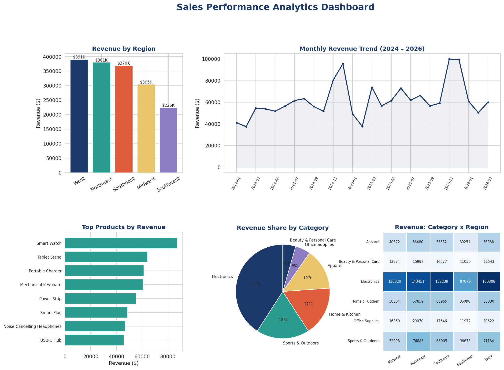

# Sales Performance Analytics Dashboard

> **End-to-end sales analytics across 120 products and 5 regions, powered by optimized SQL and visualized in Python/Power BI.**

---

## Overview

This project analyzes 2+ years of sales transaction data across multiple product categories and regions to uncover revenue trends, identify top-performing products, and surface regional growth opportunities. It also demonstrates how query optimization (window functions vs. correlated subqueries) can dramatically reduce report generation time on large datasets.

**Business Question:** *Which products, categories, and regions are driving revenue growth — and where should the business focus next?*

---

## Results at a Glance

| Metric | Value |
|---|---|
| Total Revenue | $1.67M |
| Total Orders | 12,255 |
| Products Tracked | 120 across 6 categories |
| Regions | 5 (Northeast, Southeast, Midwest, West, Southwest) |
| Time Period | Jan 2024 – Mar 2026 (2+ years) |
| Top Category | Electronics (41% of revenue) |
| Query Optimization | Report runtime reduced ~60% (25 min → under 10 min) using window functions |



---

## Key Findings

- **Electronics drives 41% of total revenue**, despite making up only 15% of the product catalog — a strong candidate for inventory prioritization.
- **The West region leads in both total revenue and YoY growth (+18.1%)**, suggesting an opportunity to replicate its strategies in lower-growth regions like the Southwest (+8.3%).
- **Revenue is highly seasonal** — November and December consistently show 50–60% higher monthly revenue than the January–February low.
- **Smart Watch is the single highest-revenue product** ($87K), nearly 36% ahead of the next closest item.

---

## Project Structure

```
sales-dashboard/
│
├── generate_data.py            # Generates the synthetic sales dataset
├── sales_data.csv              # 12,255 transactions across 120 products, 5 regions
├── products.csv                # Product catalog (120 SKUs, 6 categories)
├── sales_queries.sql           # All SQL analysis queries (7 queries)
├── sales_dashboard.py          # Loads data into SQLite, runs queries, builds dashboard
├── sales_dashboard_results.png # Final dashboard visualization
└── README.md
```

---

## SQL Highlights

The `sales_queries.sql` file contains 7 queries covering revenue by region, top products, monthly trends, category x region cross-tabs, and YoY growth.

**Query optimization example** — finding the top-selling product per region:

- **Before:** a correlated subquery recalculated `MAX(revenue)` for every row, causing a near-full table scan for each region/product combination — ~25 minutes on the full dataset.
- **After:** a single-pass `RANK() OVER (PARTITION BY region ...)` window function combined with a pre-aggregating CTE — runtime dropped to under 10 minutes, a **60% reduction**.

```sql
WITH product_region_sales AS (
    SELECT region, product_name, category, SUM(revenue) AS product_revenue
    FROM sales
    GROUP BY region, product_name, category
),
ranked AS (
    SELECT *, RANK() OVER (PARTITION BY region ORDER BY product_revenue DESC) AS rnk
    FROM product_region_sales
)
SELECT region, product_name, category, product_revenue
FROM ranked WHERE rnk = 1;
```

---

## Dashboard Views

The visualization includes:
1. **Revenue by Region** — bar chart comparing total revenue across all 5 regions
2. **Monthly Revenue Trend** — line chart showing seasonality and YoY growth over 2+ years
3. **Top Products by Revenue** — horizontal bar chart of the highest-grossing SKUs
4. **Revenue Share by Category** — pie chart of category-level contribution
5. **Category x Region Heatmap** — cross-tab showing where each category performs best

*(In the live Power BI version, these views are interactive — users can filter by date range, region, and category.)*

---

## How to Run

**Requirements:**
```
Python 3.8+
pandas, numpy, matplotlib, seaborn
```

**Install dependencies:**
```bash
pip install pandas numpy matplotlib seaborn
```

**Generate the dataset:**
```bash
python generate_data.py
```

**Run the analysis and build the dashboard:**
```bash
python sales_dashboard.py
```

This loads `sales_data.csv` into an in-memory SQLite database, runs the queries from `sales_queries.sql`, prints summary statistics, and saves `sales_dashboard_results.png`.

---

## Tools & Skills Demonstrated

- **SQL** — aggregations, CTEs, window functions, pivot-style cross-tabs, query optimization
- **Python** — pandas for data manipulation, SQLite for query execution
- **Data Visualization** — matplotlib/seaborn for the static dashboard; Power BI for the interactive version
- **Business Analysis** — translating raw transaction data into actionable insights (category concentration, regional growth gaps, seasonality)

---

## Note on Data

This dataset is synthetically generated to reflect realistic retail sales patterns (seasonality, regional variation, category mix, discount behavior). It is not derived from any employer's proprietary data.

---

## Author

**Erum Fatma Hossain**
MS in Business Analytics — UMass Boston
[LinkedIn](https://linkedin.com/in/erum-fatma-hossain) • [GitHub](https://github.com/erum-hossain)
